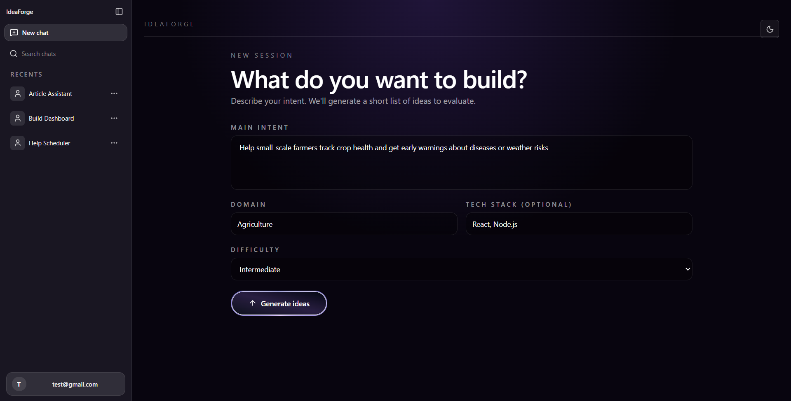

# IdeaForge 🚀

IdeaForge is a premium AI-powered project ideation and planning platform. It helps developers and creators turn rough intents into actionable, buildable project blueprints using advanced LLMs like Google Gemini.



## ✨ Features

- **AI Ideation**: Describe your goal, domain, and difficulty, and get a curated list of project ideas.
- **Iterative Refinement**: Accept strong ideas and reject weak ones to narrow down your focus.
- **Blueprint Generation**: Expand accepted ideas into full implementation plans, including features and tech stack recommendations.
- **Modern UI**: A sleek, high-fidelity dark mode interface with glassmorphism aesthetics.
- **Dual Mode**: Beautifully optimized for both Light and Dark modes.

## 🛠️ Tech Stack

### Frontend
- **Framework**: React 18 with Vite
- **Language**: TypeScript
- **Styling**: Tailwind CSS
- **Animations**: Framer Motion
- **Icons**: Lucide React
- **Routing**: React Router

### Backend
- **Server**: Node.js with Express
- **Language**: TypeScript
- **Database**: SQLite (via `sqlite3` and `sqlite`)
- **AI Integration**: Google Generative AI (Gemini)
- **Authentication**: JWT & BcryptJS
- **Validation**: Zod

## 🚀 Getting Started

### Prerequisites
- Node.js (v18 or higher)
- npm or yarn

### Installation

1. **Clone the repository**:
   ```bash
   git clone https://github.com/x64bhs/Design-Thinking.git
   cd Design-Thinking
   ```

2. **Set up the Backend**:
   ```bash
   cd Backend
   npm install
   ```
   Create a `.env` file in the `Backend` directory and add your keys:
   ```env
   PORT=3000
   JWT_SECRET=your_secret_key
   GEMINI_API_KEY=your_gemini_api_key
   ```

3. **Set up the Frontend**:
   ```bash
   cd ../Frontend
   npm install
   ```

### Running the Application

1. **Start the Backend**:
   ```bash
   cd Backend
   npm run dev
   ```

2. **Start the Frontend**:
   ```bash
   cd Frontend
   npm run dev
   ```

3. Open your browser and navigate to `http://localhost:5173`.

## 📁 Project Structure

```text
.
├── Backend/           # Node.js Express server
│   ├── src/           # TypeScript source files
│   ├── data/          # SQLite database files
│   └── tsconfig.json  # Backend TS config
├── Frontend/          # React Vite application
│   ├── src/           # Component and page files
│   ├── public/        # Static assets
│   └── vite.config.ts # Vite configuration
└── .gitignore         # Root git ignore rules
```

## 📄 License

This project is private and for internal use only.

---
Built with ❤️ for creators everywhere.
